# CS61CPU

Look ma, I made a CPU! Here's what I did:

## CPU

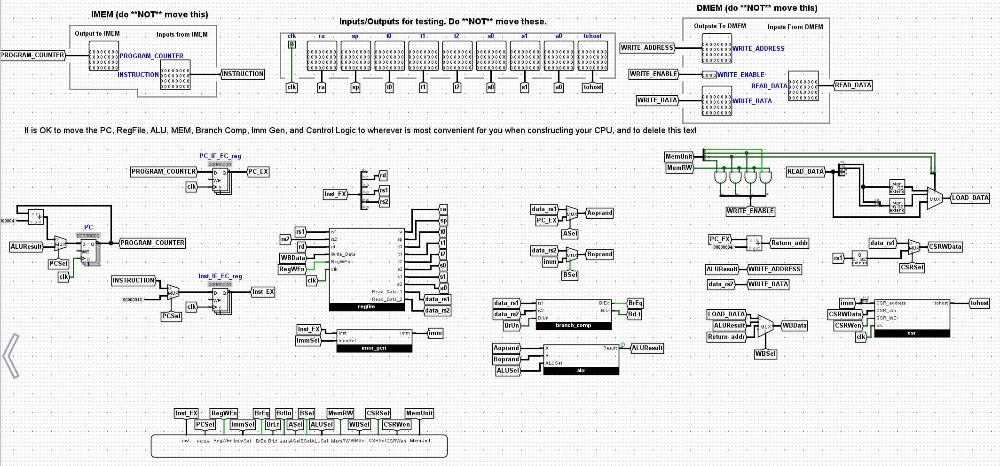

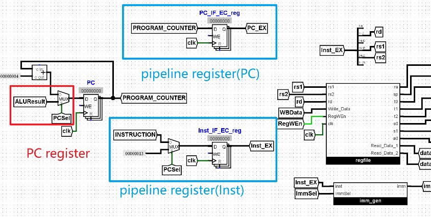

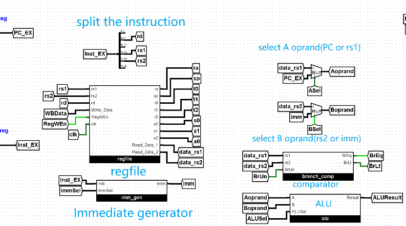

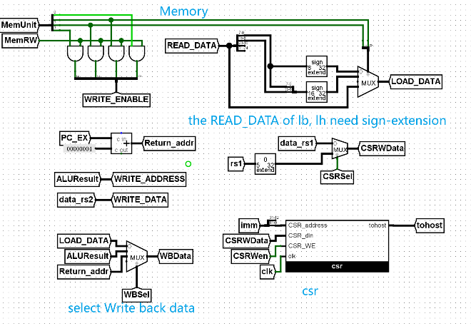

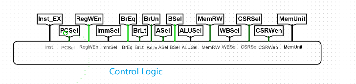

## Regfile

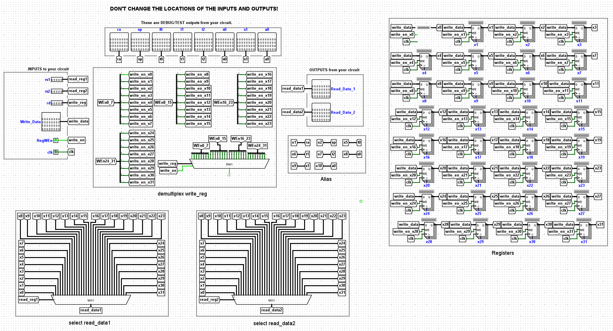

如下是所有的寄存器，每一个寄存器都有独自的write_en(写使能信号)，但是他们的CLK和write_data信号是一样的，最终有各自的输出

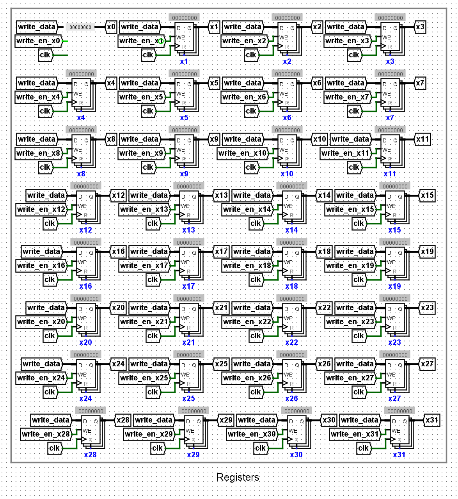

如下是根据输入的写信号，分解为哪个寄存器的使能信号有效

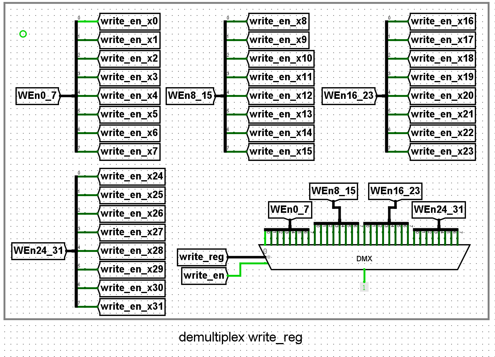

选择rs1和rs2的寄存器读出

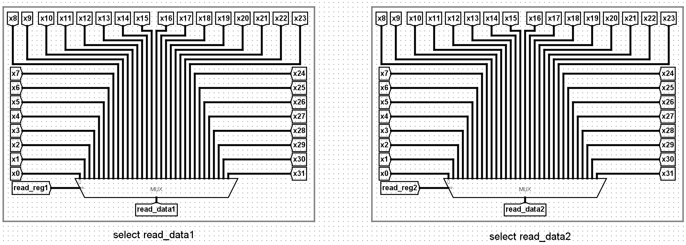

## CSR

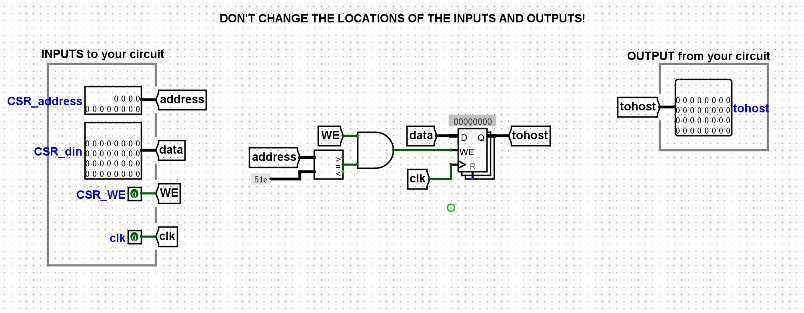

这里面其实就是一个寄存器，根据要求，仅仅在地址为51e的时候能输出到里面的寄存器

## ImmGen

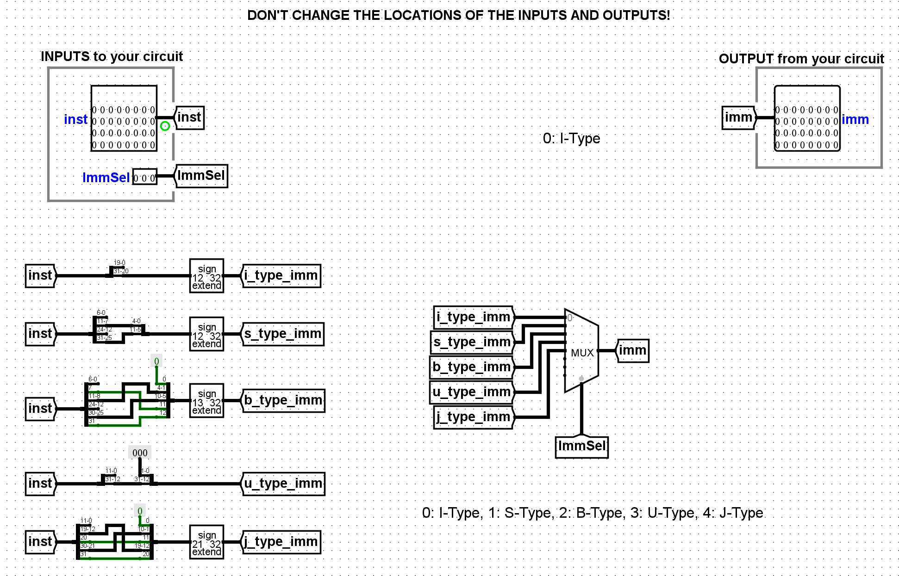

1. 包含立即数的指令有5种，每种都各自生成对应的立即数
2. 然后使用输入的ImmSel，通过多路复用器选择对应的应该的数字

## ALU

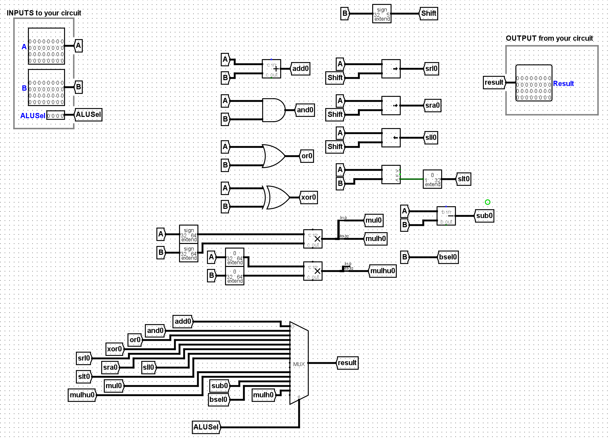

题目中总共要求了14种运算，在ALU中全部计算，然后通过多路复用器选择指令对应的计算结果

## Control Logic

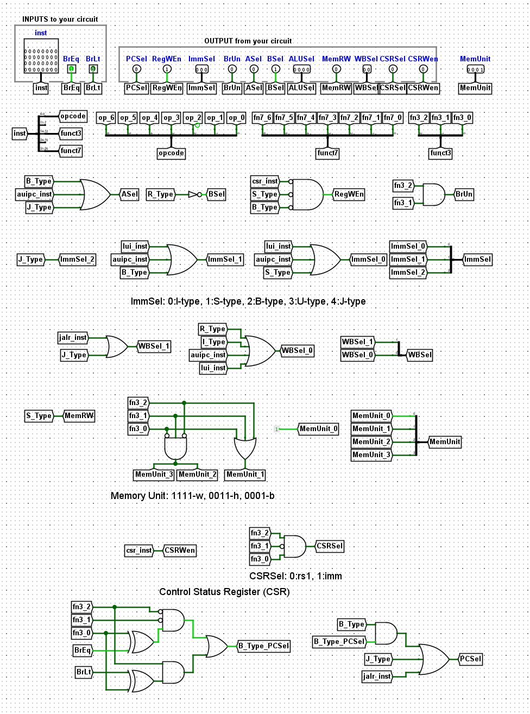

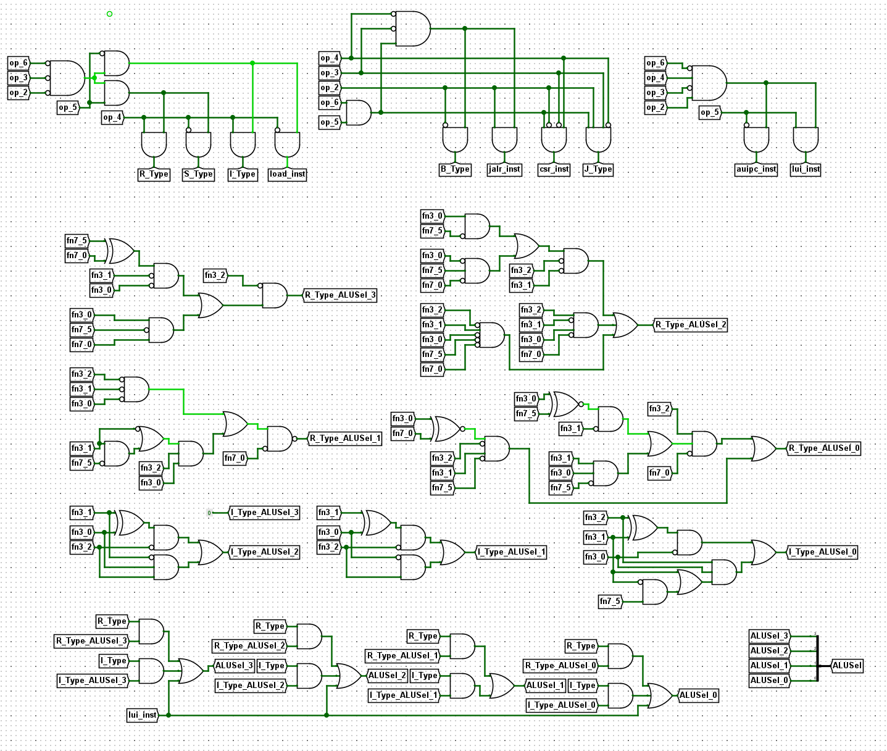

这是整个电路设计中最复杂的内容，==每一个输出信号，对应每一种，每一条指令的结果都是不一样的，需要具体分析==。

与Control Logic控制相关的部分为funct7, funct3和opcode，因此首先将其分解

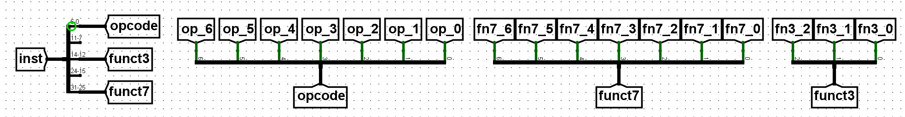

### old version

在最初设计的时候，将opcode与funct7和funct3看做等同的结构，每一个输出信号都需要经历完整的列表，简化表达式，构建电路图的经过，这里以几个为例

如下是当初对ASel和BSel的分析，这两个指令只与opcode相关

这里需要根据要求，将所有的格式的指令都列出来，逐个分析其ASel和BSel是什么，通过布尔表达式不断简化

| type/inst     | opcode | opcode(binary) | ASel | BSel |
| ------------- | ------ | -------------- | ---- | ---- |
| R-type        | 0x33   | 0110011        | 0    | 0    |
| I-type        | 0x13   | 0010011        | 0    | 1    |
| load          | 0x03   | 0000011        | 0    | 1    |
| jalr          | 0x67   | 1100111        | 0    | 1    |
| csr           | 0x73   | 1110011        | /    | /    |
| S-Type        | 0x23   | 0100011        | 0    | 1    |
| B-Type        | 0x63   | 1100011        | 1    | 1    |
| U-Type(auipc) | 0x17   | 0010111        | 1    | 1    |
| U-Type(lui)   | 0x37   | 0110111        | /    | 1    |
| J-Format      | 0x6f   | 1101111        | 1    | 1    |

这里得到最初的结果

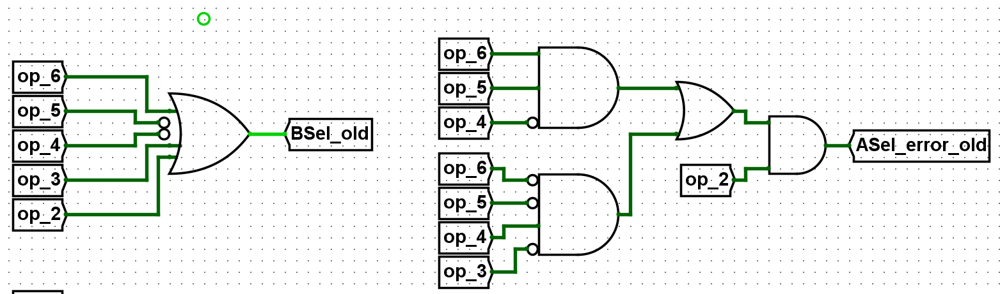

缺点

1. 太过麻烦了，每一个输出的bit都需要重新整理，做重复的步骤
2. 可读性太差，不知道其中的含义
3. 修改太麻烦，如果出现错误，每次修改都需要从头开始，如上，在第一次做的时候ASel的分析出错了，某一条指令应该为1，但是我写为了0，这样要修改电路需要重新修改

如下是ImmSel

| type/inst     | Type | opcode | opcode(binary) | Imm  | Imm_2 | Imm_1 | Imm_0 |
| ------------- | ---- | ------ | -------------- | ---- | ----- | ----- | ----- |
| R-type        | R    | 0x33   | 0110011        | /    | /     | /     | /     |
| I-type        | I    | 0x13   | 0010011        | 0    | 0     | 0     | 0     |
| load          | I    | 0x03   | 0000011        | 0    | 0     | 0     | 0     |
| jalr          | I    | 0x67   | 1100111        | 0    | 0     | 0     | 0     |
| csr           | I    | 0x73   | 1110011        | 0    | 0     | 0     | 0     |
| S-Type        | S    | 0x23   | 0100011        | 1    | 0     | 0     | 1     |
| B-Type        | B    | 0x63   | 1100011        | 2    | 0     | 1     | 0     |
| U-Type(auipc) | U    | 0x17   | 0010111        | 3    | 0     | 1     | 1     |
| U-Type(lui)   | U    | 0x37   | 0110111        | 3    | 0     | 1     | 1     |
| J-Format      | J    | 0x6f   | 1101111        | 4    | 1     | 0     | 0     |

> Note: 对于一个输出项，如果有多个bit构成，那么每个bit都需要单独构建

仍然采用上述的方法

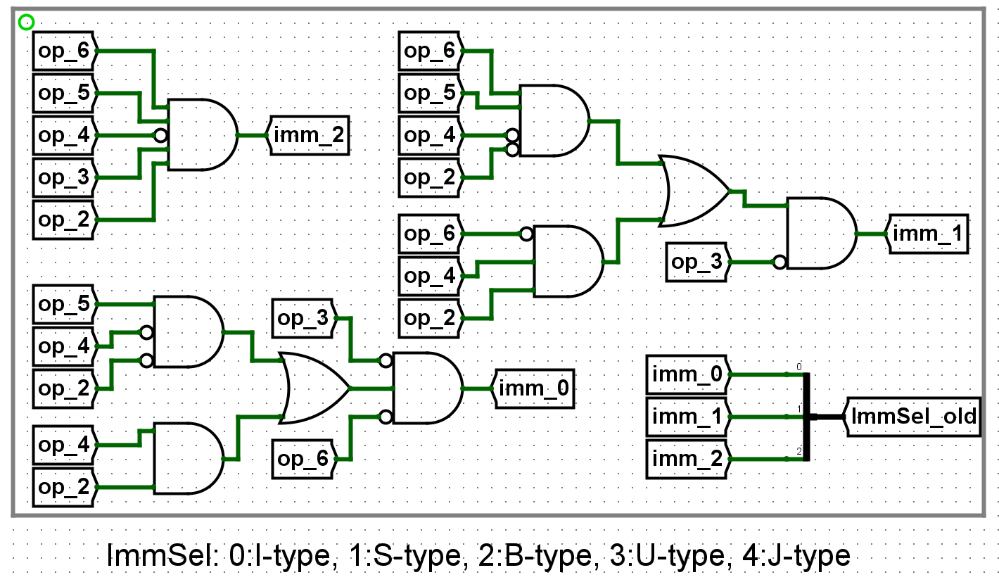

最初的很多输出项都是如此

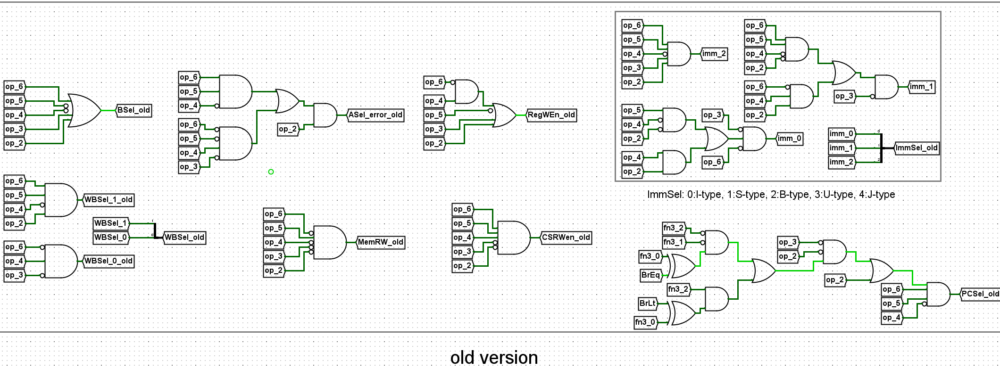

### new version

opcode的目的就是为了辨别指令的类型的，这些输出仅仅与指令类型相关，那么我们就可以先判断指令的类型，根据类型输出结果，如下(这里先尽可能的合并，这样可以节省电路元件)

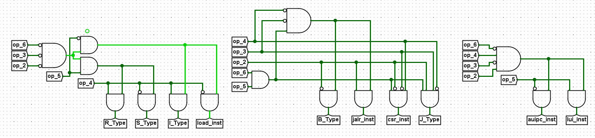

然后很多输出就可以根据指令类型实现了

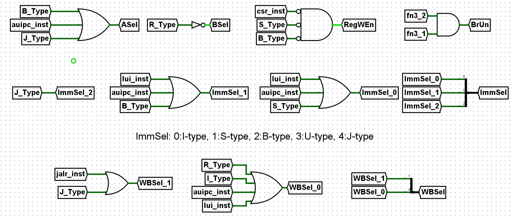

### ALUSel

这个是最复杂的信号，如下是各个指令对应的输出

| type/inst     | opcode | opcode(binary) | ALUSel               |
| ------------- | ------ | -------------- | -------------------- |
| R-type        | 0x33   | 0110011        | 复杂，与fn7和fn3相关 |
| I-type        | 0x13   | 0010011        | 复杂，与fn7与fn3相关 |
| load          | 0x03   | 0000011        | 0(add)               |
| jalr          | 0x67   | 1100111        | 0(add)               |
| csr           | 0x73   | 1110011        | /                    |
| S-Type        | 0x23   | 0100011        | 0(add)               |
| B-Type        | 0x63   | 1100011        | 0(add)               |
| U-Type(auipc) | 0x17   | 0010111        | 0(add)               |
| U-Type(lui)   | 0x37   | 0110111        | 13(bsel)             |
| J-Format      | 0x6f   | 1101111        | 0(add)               |

可以看到，R-Type和I-Type都是与fn7个fn3相关的，这两个每个都需要单独分析(除此之外，只有lui指令为13，其余都为0)

此时如果将opcode和fn7和fn3一样的话，那么最终将成为一个输入超级多的变量，这样是及其复杂的，

但是，将类型分类之后，我们可以分别对R-Type和I-Type进行实现，然后根据指令类型选择

首先是R-Type的分析

| **Instruction**    | **Funct3** | **Funct7/Immediate** | **Operation**                               | ALUSel |
| ------------------ | ---------- | -------------------- | ------------------------------------------- | ------ |
| add rd, rs1, rs2   | 0x0        | 0x00                 | R[rd] ← R[rs1] + R[rs2]                     | 0000   |
| mul rd, rs1, rs2   | 0x0        | 0x01                 | R[rd] ← (R[rs1] * R[rs2])[31:0]             | 1010   |
| sub rd, rs1, rs2   | 0x0        | 0x20                 | R[rd] ← R[rs1] - R[rs2]                     | 1100   |
| sll rd, rs1, rs2   | 0x1        | 0x00                 | R[rd] ← R[rs1] << R[rs2]                    | 0110   |
| mulh rd, rs1, rs2  | 0x1        | 0x01                 | R[rd] ← (R[rs1] * R [rs2])[63:32]           | 1110   |
| mulhu rd, rs1, rs2 | 0x3        | 0x01                 | (unsigned) R[rd] ← (R[rs1] * R[rs2])[63:32] | 1011   |
| slt rd, rs1, rs2   | 0x2        | 0x00                 | R[rd] ← (R[rs1] < R[rs2]) ? 1 : 0 (signed)  | 0111   |
| xor rd, rs1, rs2   | 0x4        | 0x00                 | R[rd] ← R[rs1] ^ R[rs2]                     | 0011   |
| srl rd, rs1, rs2   | 0x5        | 0x00                 | (unsigned) R[rd] ← R[rs1] >> R[rs2]         | 0100   |
| sra rd, rs1, rs2   | 0x5        | 0x20                 | (signed) R[rd] ← R[rs1] >> R[rs2]           | 0101   |
| or rd, rs1, rs2    | 0x6        | 0x00                 | R[rd] ← R[rs1] \| R[rs2]                    | 0010   |
| and rd, rs1, rs2   | 0x7        | 0x00                 | R[rd] ← R[rs1] & R[rs2]                     | 0001   |

然后提取出funct3和funct7的每一位和输出，构建表格

| Fn3    |        |        | Fn7  |        |      |      |      |      |        | ALUSel |      |      |      |
| ------ | ------ | ------ | ---- | ------ | ---- | ---- | ---- | ---- | ------ | ------ | ---- | ---- | ---- |
| **A9** | **A7** | **A8** | A6   | **A5** | A4   | A3   | A2   | A2   | **A0** | B3     | B2   | B1   | B0   |
| 0      | 0      | 0      | 0    | 0      | 0    | 0    | 0    | 0    | 0      | 0      | 0    | 0    | 0    |
| 0      | 0      | 0      | 0    | 0      | 0    | 0    | 0    | 0    | 1      | 1      | 0    | 1    | 0    |
| 0      | 0      | 0      | 0    | 1      | 0    | 0    | 0    | 0    | 0      | 1      | 1    | 0    | 0    |
| 0      | 1      | 0      | 0    | 0      | 0    | 0    | 0    | 0    | 0      | 0      | 1    | 1    | 0    |
| 0      | 1      | 0      | 0    | 0      | 0    | 0    | 0    | 0    | 1      | 1      | 1    | 1    | 0    |
| 0      | 1      | 1      | 0    | 0      | 0    | 0    | 0    | 0    | 1      | 1      | 0    | 1    | 1    |
| 0      | 0      | 1      | 0    | 0      | 0    | 0    | 0    | 0    | 0      | 0      | 1    | 1    | 1    |
| 1      | 0      | 0      | 0    | 0      | 0    | 0    | 0    | 0    | 0      | 0      | 0    | 1    | 1    |
| 1      | 1      | 0      | 0    | 0      | 0    | 0    | 0    | 0    | 0      | 0      | 1    | 0    | 0    |
| 1      | 1      | 0      | 0    | 1      | 0    | 0    | 0    | 0    | 0      | 0      | 1    | 0    | 1    |
| 1      | 0      | 1      | 0    | 0      | 0    | 0    | 0    | 0    | 0      | 0      | 0    | 1    | 0    |
| 1      | 1      | 1      | 0    | 0      | 0    | 0    | 0    | 0    | 0      | 0      | 0    | 0    | 1    |

这里发现有几位是不会变的，因此不用管

| **A9** | **A8** | **A7** | **A5** | **A0** | B3   | B2   | B1   | B0   |
| ------ | ------ | ------ | ------ | ------ | ---- | ---- | ---- | ---- |
| 0      | 0      | 0      | 0      | 0      | 0    | 0    | 0    | 0    |
| 0      | 0      | 0      | 0      | 1      | 1    | 0    | 1    | 0    |
| 0      | 0      | 0      | 1      | 0      | 1    | 1    | 0    | 0    |
| 0      | 0      | 1      | 0      | 0      | 0    | 1    | 1    | 0    |
| 0      | 0      | 1      | 0      | 1      | 1    | 1    | 1    | 0    |
| 0      | 1      | 1      | 0      | 1      | 1    | 0    | 1    | 1    |
| 0      | 1      | 0      | 0      | 0      | 0    | 1    | 1    | 1    |
| 1      | 0      | 0      | 0      | 0      | 0    | 0    | 1    | 1    |
| 1      | 0      | 1      | 0      | 0      | 0    | 1    | 0    | 0    |
| 1      | 0      | 1      | 1      | 0      | 0    | 1    | 0    | 1    |
| 1      | 1      | 0      | 0      | 0      | 0    | 0    | 1    | 0    |
| 1      | 1      | 1      | 0      | 0      | 0    | 0    | 0    | 1    |

这里需要为B3，B2，B1，B0单独实现

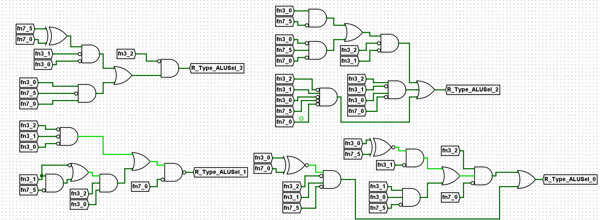

I-Type也是同理(这里就不多做赘述了)

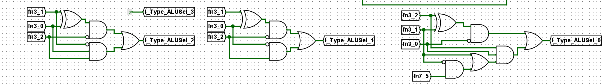

最终根据类型进行选择

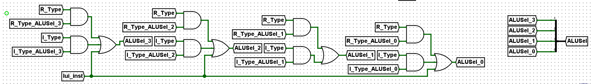

### PCSel

这里和ALUSel有点类似，但是很简单

分析如下

| type/inst     | opcode | opcode(binary) | funct3 | BrEq | BrLt | PCSel |
| ------------- | ------ | -------------- | ------ | ---- | ---- | ----- |
| R-type        | 0x33   | 0110011        |        |      |      |       |
| I-type        | 0x13   | 0010011        |        |      |      |       |
| load          | 0x03   | 0000011        |        |      |      |       |
| jalr          | 0x67   | 1100111        |        |      |      | 1     |
| csr           | 0x73   | 1110011        |        |      |      |       |
| S-Type        | 0x23   | 0100011        |        |      |      |       |
| B-Type        | 0x63   | 1100011        | 000    | 1    |      | 1     |
|               |        |                | 001    | 0    |      | 1     |
|               |        |                | 100    |      | 1    | 1     |
|               |        |                | 101    |      | 0    | 1     |
|               |        |                | 110    |      | 1    | 1     |
|               |        |                | 111    |      | 0    | 1     |
| U-Type(auipc) | 0x17   | 0010111        |        |      |      |       |
| U-Type(lui)   | 0x37   | 0110111        |        |      |      |       |
| J-Format      | 0x6f   | 1101111        |        |      |      | 1     |

可以看到，只有B-TYpe，J-Type,和jalr三种指令的PCSel为1，涉及的指令很少，因此很好实现(甚至可以直接用opcode的bits，在上面的old version中就是这样实现的)

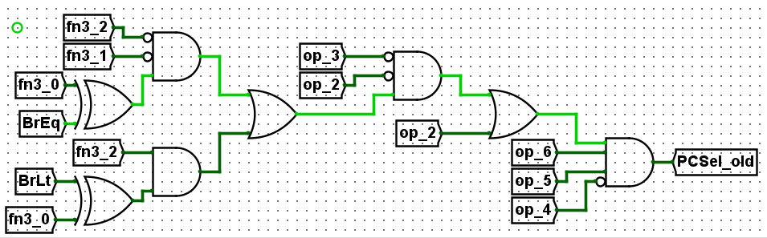

如下是单独实现了Branch的PCSel，然后根据类型合并的

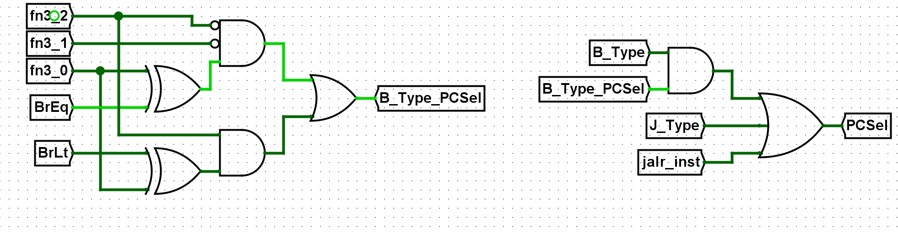

## Memory

课程中已经实现了，可以学习如何进行字扩展和位扩展(这里是进行了位扩展，每个RAM的地址都是一样的，将Data进行了拆分)

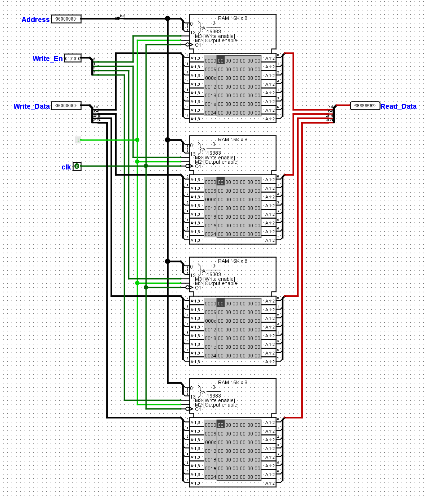

并且为了对其，最后两位直接忽略了

## Test & Debug

custom test都已经保存在了指定的目录下了，这里说几个要注意的事项

1. 在进行load和store指令的测试的时候，避免存在非4的倍数的地址，例如0x0fff，这样可能会造成冲突，而是为0x0ff0
2. load和store指令尽量避免将数据存在0xfff0这样的高地址，这样会与stack冲突，从而造成数据覆盖
3. 这里我将proj2中所有实现的方法(没有涉及读写这样的系统调用的函数)全部都测试了

如何进行调试：

1. 不论是进行Unit test还是integration test时，进行测试后，首先对比给出的student.out和reference.out，找出不同的时间点T
2. 然后找到那个不同时间点对应的指令(由于使用了流水线啊，因此某个时间点的结果是前面的第二个指令执行的结果)

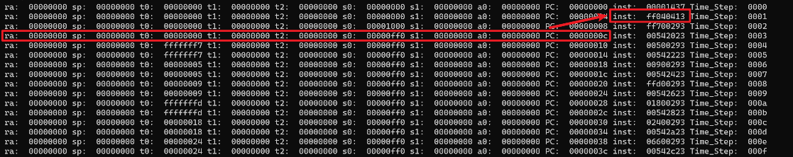

3. 然后拆分出指令标识的含义(先根据opcode确定指令类型，进行划分，然后根据funct3和funct7来确定指令的类型)

例如这里的ff040413，其二进制表示为1111 1111 0000 0100 0000 0100 0001 0011

- opcode: 0x13，I-type
- funct 3: 000 - addi指令
- rd: x8, rs2: x8
- imm: 0xff0

由此可以确定指令为: `addi x8, x8, 0xff0`

4. 在原先的RISC-V程序中找到对应的汇编指令，从而得知哪一条出现了问题，并且估计当时的寄存器应该是什么值
5. 然后打开对应的电路

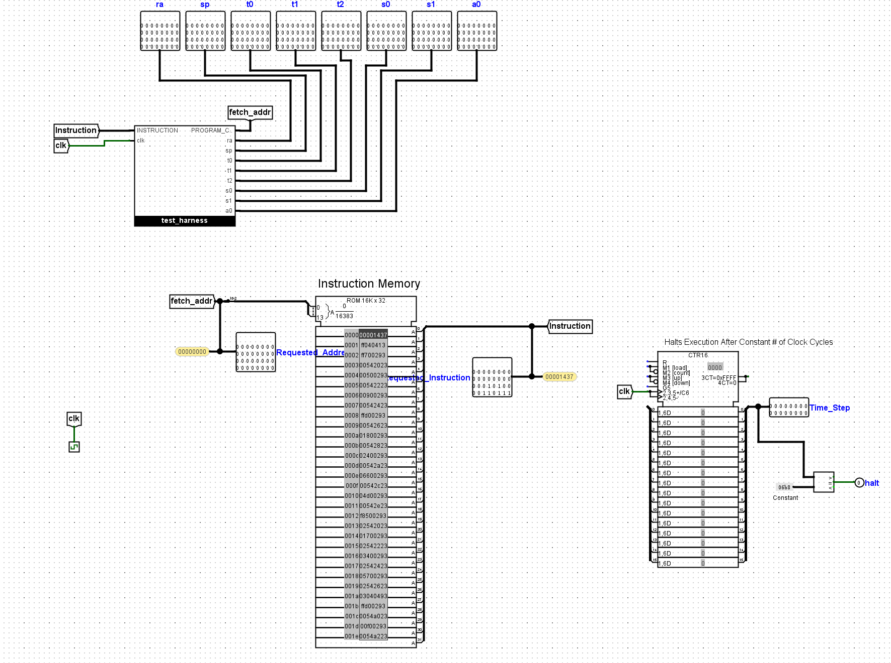

6. 逐个运行该程序(这里可以手动点击CLK，也可以按快捷键Ctrl + T，这样可以在不同的组件界面来执行下一步)
7. 如果程序很大，并且错误的指令在很后面，可以采用的方法
    - 如果是在很大的integration test中，可以缩减程序大小: 例如在在测试向量乘法的时候，有9×9的向量乘法出现了问题，此时进行Debug会有很大的问题，涉及的指令很多，此时可以缩减为1×1，2×2的向量乘法，先解决小规模的问题，然后查看大规模的情况
    - 或者将某个出错的问题单独提取出来，构成Unit test
    - 如果错误的指令在程序很后面，使用Ctrl + T一条一条的过会比较麻烦，可以采用自动模拟

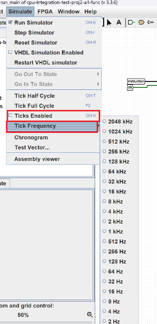

待程序执行到接近错误指令的时候，停止，然后手动前进

8. 在执行错误指令时，可以逐个排查寄存器的值，立即数的值，以及每个控制信号等，看哪个不符合预期
9. 如果某个寄存器的值出现了问题，或者内存读取的值不符合预取，那么就需要逐个往前排查，看什么时候这个值是出现问题的
