# 思路

> 这一部分是自己在做这个项目的时候的复习和思考的过程，比较简略

## Instruction

要做PartB，还是首先得回顾一下ISA都有些什么，每个field都对应着不同的Control signals的信息

然后每条指令都涉及一些控制型号，咱们对应每种型号逐个来看

涉及的信号包括

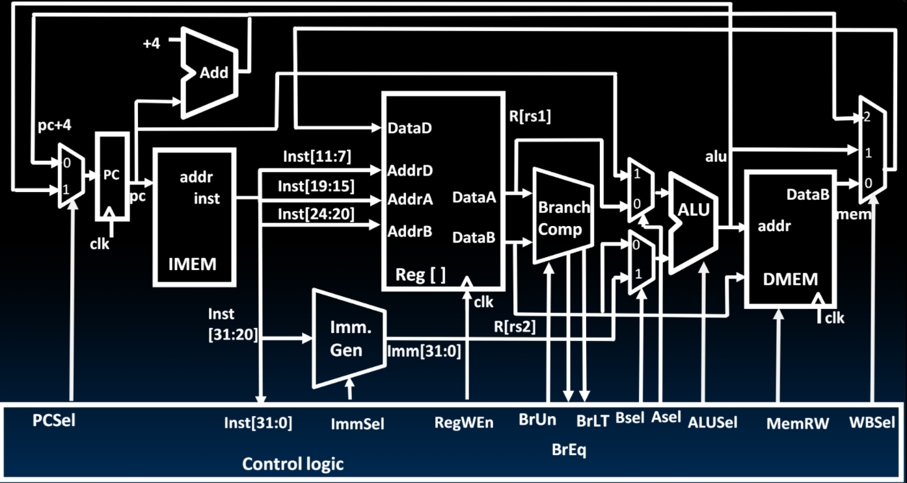

1. ImmSel: 选择立即数是如何生成的
2. RegWen: 确定是否是写寄存器的
3. BrUn: 确定比较是不是无符号比较
4. ASel, BSel: 确定ALU的操作数都是哪个
5. ALUSel: 选择什么操作
6. MemRW: 这里确定是否写入寄存器(这里只有sw才会写入吧)
7. WBSel: 确定写回到寄存器的数据是什么
8. PCSel: 写回PC的是什么信号

这些信号应该都是独立的，并且不是所有类型的指令都涉及这些所有的控制信号，每种指令只需要关注其涉及的即可

| Control signal | 结果(或者是否有关) | 备注 | 与什么相关 |
| -------------- | ------------------ | ---- | ---------- |
| ImmSel         |                    |      |            |
| RegWen         |                    |      |            |
| BrUn           |                    |      |            |
| ASel           |                    |      |            |
| BSel           |                    |      |            |
| ALUSel         |                    |      |            |
| MemRW          |                    |      |            |
| WBSel          |                    |      |            |
| PCSel          |                    |      |            |

### R-Format

【R-Format】

R-Type只有一种，就是进行加减乘除的


| instruction | funct7  | rs2  | rs1  | funct3 | rd   | opcode  |
| ----------- | ------- | ---- | ---- | ------ | ---- | ------- |
| add         | 0000000 | -    | -    | 000    | -    | 0110011 |
| sub         | 0100000 | -    | -    | 000    | -    | -       |
| sll         | 0000000 | -    | -    | 001    | -    | -       |
| slt         | 0000000 | -    | -    | 010    | -    | -       |
| sltu        | 0000000 | -    | -    | 011    | -    | -       |
| xor         | 0000000 | -    | -    | 100    | -    | -       |
| srl         | 0000000 | -    | -    | 101    | -    | -       |
| sra         | 0100000 | -    | -    | 101    | -    | -       |
| or          | 0000000 | -    | -    | 110    | -    | -       |
| and         | 0000000 | -    | -    | 111    | -    | -       |
| mulh        |         |      |      |        |      |         |
| mulhu       |         |      |      |        |      |         |

Note:

1. 这种指令与ImmSel, BrUn, MemRW是没有关系的
2. RegWen = 1，这里所有的指令的结果都是要写入到寄存器当中的，因此RegWen = 1，这里与opcode相关
3. ASel = 0, 表示从寄存器中读取的数据，这里与opcode相关
4. BSel = 0, 表示从寄存器中读取的数据，这里与opcode相关
5. WBSel = 1, 表示从ALU计算得到的结果，这里与opcode相关
6. 最难的就是ALUSel了，这里与funct7和funct3是相关的

| Control signal | 结果(或者是否有关) | 备注                     | 与什么相关                |
| -------------- | ------------------ | ------------------------ | ------------------------- |
| ImmSel         | R-Type             |                          | opcode                    |
| RegWen         | 1                  | 结果始终是写到寄存器中的 | opcode                    |
| BrUn           | 无关               |                          |                           |
| ASel           | 0                  | 寄存器                   | opcode                    |
| BSel           | 0                  | 寄存器                   | opcode                    |
| ALUSel         | 比较复杂           | 和指令相关               | opcode + funct7 + funct 3 |
| MemRW          | 0                  | 不允许写入               | opcode                    |
| WBSel          | 1                  | ALU的结果                |                           |
| PCSel          | 0                  | PC + 4                   |                           |
| CSRSel         | 无关               |                          |                           |
| CSRWen         | 0                  | 不允许写入               |                           |

### I-Format

#### 运算指令

```assembly
addi rd, rs1, imm
```

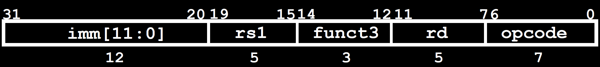

相关指令如下

| instruction | imm            | rs1  | funct3  | rd   | opcode  |
| ----------- | -------------- | ---- | ------- | ---- | ------- |
| addi        | imm\[11:0]     | -    | 000     | -    | 0010011 |
| slti        | -              | -    | 010     | -    | -       |
| sltiu       | -              | -    | 011     | -    | -       |
| xori        | -              | -    | 100     | -    | -       |
| ori         | -              | -    | 110     | -    | -       |
| andi        | -              | -    | 111     | -    | -       |
| slli        | 0000000\|shamt | -    | 001     | -    | -       |
| srli        | 0000000\|shamt | -    | **101** | -    | -       |
| srai        | 0100000\|shamt | -    | **101** | -    | -       |

| Control signal | 结果(或者是否有关) | 备注                     | 与什么相关            |
| -------------- | ------------------ | ------------------------ | --------------------- |
| BrUn           | 无关               |                          |                       |
| MemRW          | 无关               |                          |                       |
| ImmSel         | I-Type(0)          | 选择imm的格式是一样的    | opcode(0010011, 0x13) |
| RegWen         | 1                  | 结果永远是写到寄存器中的 | opcode                |
| ASel           | 0                  | 从寄存器中读取的数据     | opcode                |
| BSel           | 1                  | 立即数                   | opcode                |
| ALUSel         | 复杂               | 这里和funct7和funct3相关 | funct7 + funct3       |
| WBSel          | 1                  | ALU的计算结果            | opcode                |
| CSRSel         | 无关               |                          |                       |
| CSRWen         | 0                  | 不允许写入               |                       |

#### Load指令

```
lw x5, 8(x3)
```

只有上述这一条吧，当然还有其他的

|                    | opcode | funct3 | funct7(Imm)        |                                             |      |      |
| ------------------ | ------ | ------ | ------------------ | ------------------------------------------- | ---- | ---- |
| lb rd, offset(rs1) | 0x03   | 0x0    | 无关(这里是立即数) | R[rd] ← SignExt(Mem(R[rs1] + offset, byte)) |      |      |
| lh rd, offset(rs1) |        | 0x1    |                    | R[rd] ← SignExt(Mem(R[rs1] + offset, half)) |      |      |
| lw rd, offset(rs1) |        | 0x2    |                    | R[rd] ← Mem(R[rs1] + offset, word)          |      |      |

> 这里根据题目中的含义，好像Mem并没有对应的输入可以指明输入的类型，因此这里先不用实现了吧

这里就有点奇怪

| Control signal | 结果(或者是否有关) | 备注                           | 与什么相关 |
| -------------- | ------------------ | ------------------------------ | ---------- |
| ImmSel         | I-Type             | 这里的offset是立即数           | opcode     |
| RegWen         | 0                  | 这里不允许写入到寄存器中       | opcode     |
| BrUn           | 无关               |                                |            |
| ASel           | 0                  | 寄存器读出的数据(地址)         | opcode     |
| BSel           | 1                  | 立即数offset                   | opcode     |
| ALUSel         | add                | 三种指令只有加法这一种情况了吧 | opcode     |
| MemRW          | 0                  | load指令不允许写入             | opcode     |
| WBSel          | 0                  | 写入内存的值吧                 |            |
| PCSel          | 0                  | 正常PC + 4                     |            |
| CSRSel         | 无关               |                                |            |
| CSRWen         | 0                  | 不允许写入                     |            |

#### Jalr

|                   |      | opcode | funct3 |      |                                         |
| ----------------- | ---- | ------ | ------ | ---- | --------------------------------------- |
| jalr rd, rs1, imm | I    | 0x67   | 0x0    |      | R[rd] ← PC + 4<br />PC ← R[rs1] + {imm} |

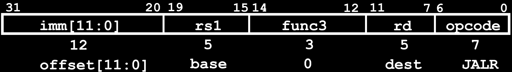

| Control signal | 结果(或者是否有关) | 备注                   | 与什么相关 |
| -------------- | ------------------ | ---------------------- | ---------- |
| ImmSel         | I-Type             |                        | opcode     |
| RegWen         | 1                  | PC + 4要写入到寄存器中 | opcode     |
| BrUn           | 无关               |                        |            |
| ASel           | 1                  | <u>PC</u> + imm        | opcode     |
| BSel           | 1                  | PC + <u>imm</u>        | opcode     |
| ALUSel         | add(0)             |                        | opcode     |
| MemRW          | 0                  | 不允许写入             | opcode     |
| WBSel          | 2                  | PC + 4写入到寄存器中   |            |
| PCSel          | 1                  | ALU的结果              |            |
| CSRSel         | 无关               |                        |            |
| CSRWen         | 0                  | 不允许写入             |            |

#### csr

|                     |      | opcode | funct3 |      |                   |
| ------------------- | ---- | ------ | ------ | ---- | ----------------- |
| csrw rd, csr, rs1   | I    | 0x73   | 0x1    |      | CSR[csr] ← R[rs1] |
| csrwi rd, csr, uimm | I    | 0x73   | 0x5    |      | CSR[csr] ← {uimm} |

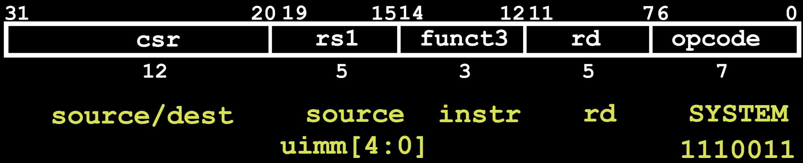

这里的instr可能有多种，但是这里仅仅需要实现这两个指令即可了

这里的rd是不变的，表示写入的寄存器

| Control signal | 结果(或者是否有关) | 备注                                        | 与什么相关 |
| -------------- | ------------------ | ------------------------------------------- | ---------- |
| ImmSel         | I-Type             |                                             | opcode     |
| RegWen         | 0                  | 这里不需要支持CSR到寄存器中，只需要写入即可 | opcode     |
| BrUn           | 无关               |                                             |            |
| ASel           | 无关               |                                             | opcode     |
| BSel           | 无关               |                                             | opcode     |
| ALUSel         | 无关               |                                             | opcode     |
| MemRW          | 0                  | 不允许写入                                  | opcode     |
| WBSel          | /                  | 这里还不允许写入惹                          |            |
| PCSel          | 0                  | PC + 4                                      |            |
| CSRSel         | 0/1                | 选择寄存器的结果还是立即数                  |            |
| CSRWen         | 1                  | 这个指令运行写入惹                          |            |

### S-Format

|                     | opcode | funct3 | funct7         |                                      |      |      |
| ------------------- | ------ | ------ | -------------- | ------------------------------------ | ---- | ---- |
| sb rs2, offset(rs1) | 0x23   | 0x0    | 这里都是立即数 | Mem(R[rs1] + offset) ← R[rs2] [7:0]  |      |      |
| sh rs2, offset(rs1) |        | 0x1    |                | Mem(R[rs1] + offset) ← R[rs2] [15:0] |      |      |
| sw rs2, offset(rs1) |        | 0x2    |                | Mem(R[rs1] + offset) ← R[rs2]        |      |      |

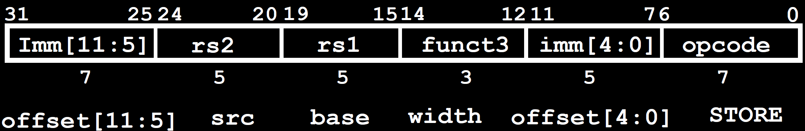

| Control signal | 结果(或者是否有关) | 备注                           | 与什么相关                 |
| -------------- | ------------------ | ------------------------------ | -------------------------- |
| ImmSel         | S-Type             | 这里的offset是立即数           | opcode                     |
| RegWen         | 0                  | 这里不允许写入到寄存器中       | opcode                     |
| BrUn           | 无关               |                                |                            |
| ASel           | 0                  | 寄存器读出的数据(地址)         | opcode                     |
| BSel           | 1                  | 立即数offset                   | opcode                     |
| ALUSel         | add                | 三种指令只有加法这一种情况了吧 | opcode                     |
| MemRW          | 1                  | store指令就是写入的            | opcode, (并且与funct3相关) |
| WBSel          | 无关               |                                |                            |
| PCSel          | 0                  | 正常PC + 4                     |                            |
| CSRSel         | 无关               |                                |                            |
| CSRWen         | 0                  | 不允许写入                     |                            |

### B-Format

```assembly
beq x1, x2, Label
```

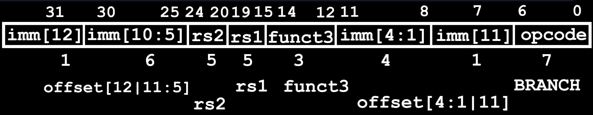

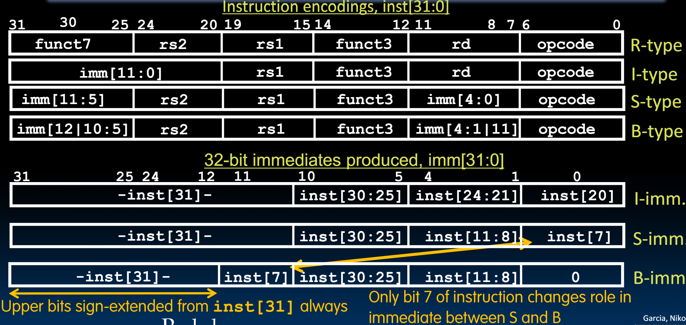

如下是指令结构

| instructions | imm           | rs2  | rs1  | branch type | imm           | opcode  |
| ------------ | ------------- | ---- | ---- | ----------- | ------------- | ------- |
| beq          | imm\[12:10:5] | rs2  | rs1  | 000         | imm\[4:1\|11] | 1100011 |
| bne          | -             | -    | -    | 100         | -             | -       |
| blt          | -             | -    | -    | 101         | -             | -       |
| bge          | -             | -    | -    | 110         | -             | -       |
| bltu         | -             | -    | -    | 111         | -             | -       |
| bgeu         | -             | -    | -    | 111         | -             | -       |

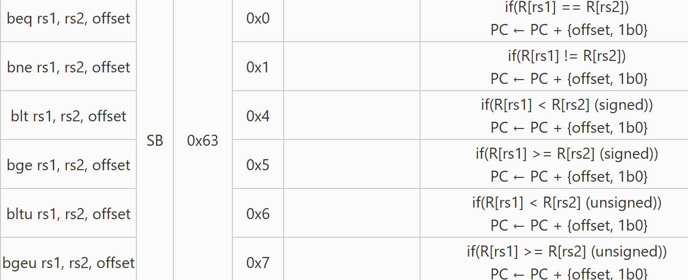

这里就需要branch了

| Control signal | 结果(或者是否有关) | 备注                     | 与什么相关                       |
| -------------- | ------------------ | ------------------------ | -------------------------------- |
| ImmSel         | B-Type             | 这里的offset是立即数     | opcode                           |
| RegWen         | 0                  | 这里不允许写入到寄存器中 | opcode                           |
| BrUn           | 相关               | 需要区别是否是无符号比较 | funct3 (其余的指令都不会用beq了) |
| ASel           | 无关               |                          | opcode                           |
| BSel           | 无关               |                          | opcode                           |
| ALUSel         | 无关               |                          | opcode                           |
| MemRW          | 0                  | 不允许写入               | opcode                           |
| WBSel          | 无关               |                          |                                  |
| PCSel          | 有关               | 这里需要判断与什么相关   | opcode，funct3以及BrEq和BrLT     |
| CSRSel         | 无关               |                          |                                  |
| CSRWen         | 0                  | 不允许写入               |                                  |

### U-Format

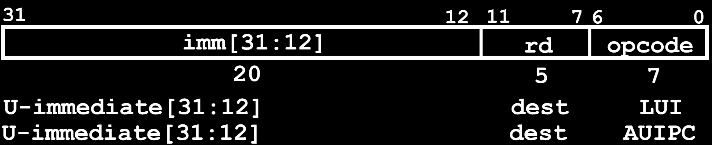

| 指令             | opcode | 立即数                         |      |                             |      |
| ---------------- | ------ | ------------------------------ | ---- | --------------------------- | ---- |
| auipc rd, offset | 0x17   | 没有funct7和funct3，全是立即数 |      | R[rd] ← PC + {offset, 12b0} |      |
| lui rd, offset   | 0x37   |                                |      | R[rd] ← {offset, 12b0}      |      |

| Control signal | 结果(或者是否有关)                     | 备注                     | 与什么相关 |
| -------------- | -------------------------------------- | ------------------------ | ---------- |
| ImmSel         | U-Type                                 |                          | opcode     |
| RegWen         | 1                                      | 结果都是写入到寄存器当中 | opcode     |
| BrUn           | 无关                                   | 不需要比较               |            |
| ASel           | 1(auipc有关)                           | PC（只有auipc有关的）    | opcode     |
| BSel           | 1(auipc相关)                           | 立即数                   | opcode     |
| ALUSel         | add(0, 只有auipc相关)，BSel(这里是lui) |                          | opcode     |
| MemRW          | 0                                      | 不允许写入               | opcode     |
| WBSel          | 1                                      | ALU的操作                |            |
| PCSel          | 0                                      | PC + 4                   | opcode     |
| CSRSel         | 无关                                   |                          |            |
| CSRWen         | 0                                      | 不允许写入               |            |

这里auipc的加法是在哪里执行的

lui最终WBSel是怎么选择的？ALU有只选择B的操作

### J-Format

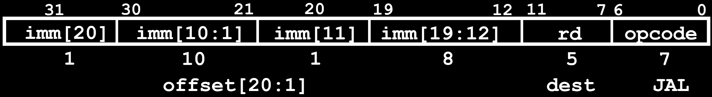

|             |      | funct7 |      |      |                                          |
| ----------- | ---- | ------ | ---- | ---- | ---------------------------------------- |
| jal rd, imm | UJ   | 0x6f   |      |      | R[rd] ← PC + 4<br />PC ← PC + {imm, 1b0} |

这个指令有两个功能

| Control signal | 结果(或者是否有关) | 备注                                     | 与什么相关 |
| -------------- | ------------------ | ---------------------------------------- | ---------- |
| ImmSel         | J-Format           |                                          | opcode     |
| RegWen         | 1                  | 有两个操作，其中一个就是写入到寄存器当中 | opcode     |
| BrUn           | 无关               |                                          |            |
| ASel           | 1                  | PC                                       | opcode     |
| BSel           | 1                  | 立即数                                   | opcode     |
| ALUSel         | 0                  | PC + imm, 1b0                            | opcode     |
| MemRW          | 0                  | 不允许写入                               | opcode     |
| WBSel          | 2                  | 写回PC + 4到rd中                         |            |
| PCSel          | 有关               | 这里需要判断与什么相关                   | opcode     |
| CSRSel         | 无关               |                                          |            |
| CSRWen         | 0                  | 不允许写入                               |            |

## 控制逻辑和其他组件的设置

控制逻辑的设计是要一个信号一个信号的设计

下面逐个信号设计

| Control signal | 与什么相关                                      | 实现情况 |
| -------------- | ----------------------------------------------- | -------- |
| ImmSel         | 只与opcode有关，与R类型指令以外的其他指令都相关 |          |
| RegWen         | 只与opcode相关，结果是1                         |          |
| BrUn           | 这里只有Branch指令会有BrUn吧                    |          |
| ASel           | 只与opcode相关                                  |          |
| BSel           | 只与opcode相关                                  |          |
| ALUSel         | 这里就与funct7和funct3相关了                    |          |
| MemRW          | 这里是只有S type的指令为1，其余都为0            |          |
| WBSel          | 这里与opcode是相关的                            |          |
| PCSel          | 就比较复杂了                                    |          |

下面逐个实现

先将已有的Opcode都给聚集起来

| 指令类型   | 具体的指令   | Opcode |
| ---------- | ------------ | ------ |
| R          | 所有的R type | 0x33   |
| I          | load指令     | 0x03   |
|            | imm操作指令  | 0x13   |
|            | jalr         | 0x67   |
|            | csrw, csrwi  | 0x73   |
| S          | sb, sh, sw   | 0x23   |
| SB(branch) | branch指令   | 0x63   |
| U          | auipc        | 0x17   |
|            | lui          | 0x37   |
| UJ         | jal          | 0x6f   |

### Imm

这里首先实现Imm逻辑吧

我们这里规定

| Type | 序号 |
| ---- | ---- |
| I    | 0    |
| S    | 1    |
| B    | 2    |
| U    | 3    |
| J    | 4    |

这里面除了U-Type，全部都需要在前面补0的

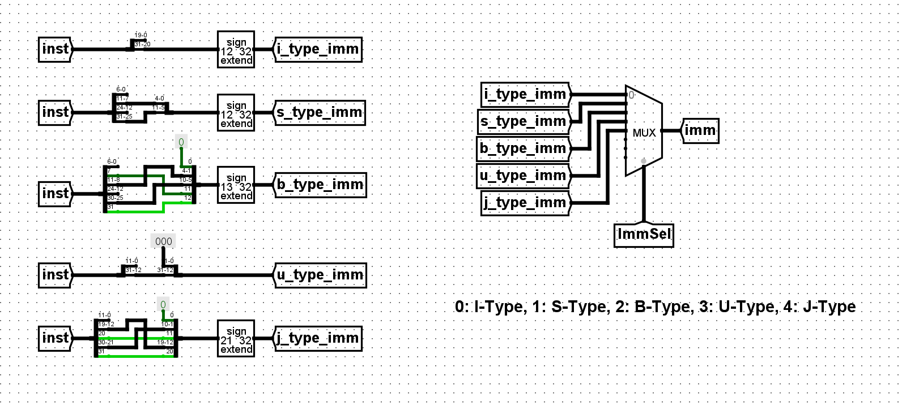

这里是每个指令都单独的

### Control Logic

下面是要实现的内容

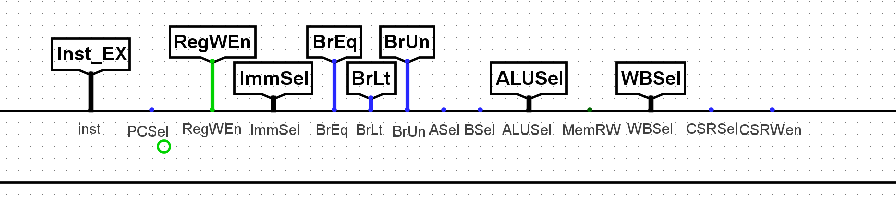

首先实现简单的逻辑吧，首先是只与Opcode相关的内容

#### RegWen

这里只与Opcode相关

| type/inst     | opcode | opcode(binary) | RegWen |
| ------------- | ------ | -------------- | ------ |
| R-type        | 0x33   | 0110011        | 1      |
| I-type        | 0x13   | 0010011        | 1      |
| load          | 0x03   | 0000011        | 1      |
| jalr          | 0x67   | 1100111        | 1      |
| csr           | 0x73   | 1110011        | 0      |
| S-Type        | 0x23   | 0100011        | 0      |
| B-Type        | 0x63   | 1100011        | 0      |
| U-Type(auipc) | 0x17   | 0010111        | 1      |
| U-Type(lui)   | 0x37   | 0110111        | 1      |
| J-Format      | 0x6f   | 1101111        | 1      |

### ImmSel

| type/inst     | Type | opcode | opcode(binary) | Imm  | Imm_2 | Imm_1 | Imm_0 |
| ------------- | ---- | ------ | -------------- | ---- | ----- | ----- | ----- |
| R-type        | R    | 0x33   | 0110011        | /    | /     | /     | /     |
| I-type        | I    | 0x13   | 0010011        | 0    | 0     | 0     | 0     |
| load          | I    | 0x03   | 0000011        | 0    | 0     | 0     | 0     |
| jalr          | I    | 0x67   | 1100111        | 0    | 0     | 0     | 0     |
| csr           | I    | 0x73   | 1110011        | 0    | 0     | 0     | 0     |
| S-Type        | S    | 0x23   | 0100011        | 1    | 0     | 0     | 1     |
| B-Type        | B    | 0x63   | 1100011        | 2    | 0     | 1     | 0     |
| U-Type(auipc) | U    | 0x17   | 0010111        | 3    | 0     | 1     | 1     |
| U-Type(lui)   | U    | 0x37   | 0110111        | 3    | 0     | 1     | 1     |
| J-Format      | J    | 0x6f   | 1101111        | 4    | 1     | 0     | 0     |

然后化简

### BrUn

这个只有B-Format会使用


这里只和funct3相关，Bformat是有立即数的，表示offset

这里只有funt3为0x6和0x7的时候为1

### ASel/BSel

这里和Opcode相关

| type/inst     | opcode | opcode(binary) | ASel | BSel |
| ------------- | ------ | -------------- | ---- | ---- |
| R-type        | 0x33   | 0110011        | 0    | 0    |
| I-type        | 0x13   | 0010011        | 0    | 1    |
| load          | 0x03   | 0000011        | 0    | 1    |
| jalr          | 0x67   | 1100111        | 0    | 1    |
| csr           | 0x73   | 1110011        | /    | /    |
| S-Type        | 0x23   | 0100011        | 0    | 1    |
| B-Type        | 0x63   | 1100011        | 1    | 1    |
| U-Type(auipc) | 0x17   | 0010111        | 1    | 1    |
| U-Type(lui)   | 0x37   | 0110111        | /    | 1    |
| J-Format      | 0x6f   | 1101111        | 1    | 1    |

### WBSel

| type/inst     | opcode | opcode(binary) | WBSel |
| ------------- | ------ | -------------- | ----- |
| R-type        | 0x33   | 0110011        | 01    |
| I-type        | 0x13   | 0010011        | 01    |
| load          | 0x03   | 0000011        | 00    |
| jalr          | 0x67   | 1100111        | 10    |
| csr           | 0x73   | 1110011        | /     |
| S-Type        | 0x23   | 0100011        | /     |
| B-Type        | 0x63   | 1100011        | /     |
| U-Type(auipc) | 0x17   | 0010111        | 01    |
| U-Type(lui)   | 0x37   | 0110111        | 01    |
| J-Format      | 0x6f   | 1101111        | 10    |

### MemRW

只有sw指令是为1的吧

| type/inst     | opcode | opcode(binary) | MemRW |
| ------------- | ------ | -------------- | ----- |
| R-type        | 0x33   | 0110011        | 1     |
| I-type        | 0x13   | 0010011        | 1     |
| load          | 0x03   | 0000011        | 1     |
| jalr          | 0x67   | 1100111        | 1     |
| csr           | 0x73   | 1110011        | 1     |
| S-Type        | 0x23   | 0100011        | 0     |
| B-Type        | 0x63   | 1100011        | 1     |
| U-Type(auipc) | 0x17   | 0010111        | 1     |
| U-Type(lui)   | 0x37   | 0110111        | 1     |
| J-Format      | 0x6f   | 1101111        | 1     |

### Write enable

这里是应该需要四个bit的控制呢

|                     | opcode | funct3 | funct3 bin |                                      | Write_Enable |      |
| ------------------- | ------ | ------ | ---------- | ------------------------------------ | ------------ | ---- |
| sb rs2, offset(rs1) | 0x23   | 0x0    | 000        | Mem(R[rs1] + offset) ← R[rs2] [7:0]  | 0001         |      |
| sh rs2, offset(rs1) |        | 0x1    | 001        | Mem(R[rs1] + offset) ← R[rs2] [15:0] | 0011         |      |
| sw rs2, offset(rs1) |        | 0x2    | 010        | Mem(R[rs1] + offset) ← R[rs2]        | 1111         |      |
|                     |        | 其余   |            |                                      |              |      |

### csr

这里的csr有两个控制信息

|                     |      | opcode | funct3 | 立即数 |                   |
| ------------------- | ---- | ------ | ------ | ------ | ----------------- |
| csrw rd, csr, rs1   | I    | 0x73   | 0x1    |        | CSR[csr] ← R[rs1] |
| csrwi rd, csr, uimm | I    | 0x73   | 0x5    |        | CSR[csr] ← {uimm} |

这里主要是控制csr的信息吧


- csrSel是控制输入的是立即数还是寄存器吧，这里只与opcode = 0x73 = 0b1110011有关
- CSRWen是控制是否写入的，这里与funct3相关，如果funct3是0x11，那么为寄存器，如果是0x101，那么是立即数，当然要在Control Logic里面将0x011和0x101转化为0和1

这里rd的作用是？应该是为了写入寄存器中使用的，这里仅仅是读寄存器，所以rd是没用的

### ALUSel

首先是除了两种计算指令以外的

| type/inst     | opcode | opcode(binary) | ALUSel               |
| ------------- | ------ | -------------- | -------------------- |
| R-type        | 0x33   | 0110011        | 复杂，与fn7和fn3相关 |
| I-type        | 0x13   | 0010011        | 复杂，与fn7与fn3相关 |
| load          | 0x03   | 0000011        | 0(add)               |
| jalr          | 0x67   | 1100111        | 0(add)               |
| csr           | 0x73   | 1110011        | /                    |
| S-Type        | 0x23   | 0100011        | 0(add)               |
| B-Type        | 0x63   | 1100011        | 0(add)               |
| U-Type(auipc) | 0x17   | 0010111        | 0(add)               |
| U-Type(lui)   | 0x37   | 0110111        | 13(bsel)             |
| J-Format      | 0x6f   | 1101111        | 0(add)               |

如下是题目要求实现的，但是mul指令是谁给的啊

如下是涉及的计算指令（如下是R-Type和I-Type的方式吧）

| **Instruction**    | **Opcode** | **Funct3** | **Funct7/Immediate** | **Operation**                               |
| ------------------ | ---------- | ---------- | -------------------- | ------------------------------------------- |
| add rd, rs1, rs2   | 0x33       | 0x0        | 0x00                 | R[rd] ← R[rs1] + R[rs2]                     |
| mul rd, rs1, rs2   |            | 0x0        | 0x01                 | R[rd] ← (R[rs1] * R[rs2])[31:0]             |
| sub rd, rs1, rs2   |            | 0x0        | 0x20                 | R[rd] ← R[rs1] - R[rs2]                     |
| sll rd, rs1, rs2   |            | 0x1        | 0x00                 | R[rd] ← R[rs1] << R[rs2]                    |
| mulh rd, rs1, rs2  |            | 0x1        | 0x01                 | R[rd] ← (R[rs1] * R [rs2])[63:32]           |
| mulhu rd, rs1, rs2 |            | 0x3        | 0x01                 | (unsigned) R[rd] ← (R[rs1] * R[rs2])[63:32] |
| slt rd, rs1, rs2   |            | 0x2        | 0x00                 | R[rd] ← (R[rs1] < R[rs2]) ? 1 : 0 (signed)  |
| xor rd, rs1, rs2   |            | 0x4        | 0x00                 | R[rd] ← R[rs1] ^ R[rs2]                     |
| srl rd, rs1, rs2   |            | 0x5        | 0x00                 | (unsigned) R[rd] ← R[rs1] >> R[rs2]         |
| sra rd, rs1, rs2   |            | 0x5        | 0x20                 | (signed) R[rd] ← R[rs1] >> R[rs2]           |
| or rd, rs1, rs2    |            | 0x6        | 0x00                 | R[rd] ← R[rs1] \| R[rs2]                    |
| and rd, rs1, rs2   |            | 0x7        | 0x00                 | R[rd] ← R[rs1] & R[rs2]                     |

|                   |      |      |      |                                |
| ----------------- | ---- | ---- | ---- | ------------------------------ |
| addi rd, rs1, imm | 0x13 | 0x0  |      | R[rd] ← R[rs1] + imm           |
| slli rd, rs1, imm |      | 0x1  | 0x00 | R[rd] ← R[rs1] << imm          |
| slti rd, rs1, imm |      | 0x2  |      | R[rd] ← (R[rs1] < imm) ? 1 : 0 |
| xori rd, rs1, imm |      | 0x4  |      | R[rd] ← R[rs1] ^ imm           |
| srli rd, rs1, imm |      | 0x5  | 0x00 | R[rd] ← R[rs1] >> imm          |
| srai rd, rs1, imm |      | 0x5  | 0x20 | R[rd] ← R[rs1] >> imm          |
| ori rd, rs1, imm  |      | 0x6  |      | R[rd] ← R[rs1] \| imm          |
| andi rd, rs1, imm |      | 0x7  |      | R[rd] ← R[rs1] & imm           |

| Switch Value | Instruction                              | fn7  | fn3  | opcode    | opcode |
| ------------ | :--------------------------------------- | ---- | ---- | --------- | ------ |
| 0            | add: `Result = A + B`                    | 0x00 | 0x0  | 0x33/0x13 |        |
| 1            | and: `Result = A & B`                    | 0x00 | 0x7  |           |        |
| 2            | or: `Result = A | B`                     | 0x00 | 0x6  |           |        |
| 3            | xor: `Result = A ^ B`                    | 0x00 | 0x4  |           |        |
| 4            | srl: `Result = (unsigned) A >> B`        | 0x00 | 0x5  |           |        |
| 6            | sll: `Result = A << B`                   | 0x00 | 0x1  |           |        |
| 7            | slt: `Result = (A < B (signed)) ? 1 : 0` | 0x00 | 0x2  |           |        |
| 12           | sub: `Result = A - B`                    | 0x20 | 0x0  |           |        |
| 5            | sra: `Result = (signed) A >> B`          | 0x20 | 0x5  |           |        |
| 10           | mul: `Result = (signed) (A * B)[31:0]`   | 0x01 | 0x0  |           |        |
| 14           | mulh: `Result = (signed) (A * B)[63:32]` | 0x01 | 0x1  |           |        |
| 11           | mulhu: `Result = (A * B)[63:32]`         | 0x01 | 0x3  |           |        |

然后是实现如下的内容

| **Instruction**    | **Funct3** | **Funct7/Immediate** | **Operation**                               | ALUSel |
| ------------------ | ---------- | -------------------- | ------------------------------------------- | ------ |
| add rd, rs1, rs2   | 0x0        | 0x00                 | R[rd] ← R[rs1] + R[rs2]                     | 0000   |
| mul rd, rs1, rs2   | 0x0        | 0x01                 | R[rd] ← (R[rs1] * R[rs2])[31:0]             | 1010   |
| sub rd, rs1, rs2   | 0x0        | 0x20                 | R[rd] ← R[rs1] - R[rs2]                     | 1100   |
| sll rd, rs1, rs2   | 0x1        | 0x00                 | R[rd] ← R[rs1] << R[rs2]                    | 0110   |
| mulh rd, rs1, rs2  | 0x1        | 0x01                 | R[rd] ← (R[rs1] * R [rs2])[63:32]           | 1110   |
| mulhu rd, rs1, rs2 | 0x3        | 0x01                 | (unsigned) R[rd] ← (R[rs1] * R[rs2])[63:32] | 1011   |
| slt rd, rs1, rs2   | 0x2        | 0x00                 | R[rd] ← (R[rs1] < R[rs2]) ? 1 : 0 (signed)  | 0111   |
| xor rd, rs1, rs2   | 0x4        | 0x00                 | R[rd] ← R[rs1] ^ R[rs2]                     | 0011   |
| srl rd, rs1, rs2   | 0x5        | 0x00                 | (unsigned) R[rd] ← R[rs1] >> R[rs2]         | 0100   |
| sra rd, rs1, rs2   | 0x5        | 0x20                 | (signed) R[rd] ← R[rs1] >> R[rs2]           | 0101   |
| or rd, rs1, rs2    | 0x6        | 0x00                 | R[rd] ← R[rs1] \| R[rs2]                    | 0010   |
| and rd, rs1, rs2   | 0x7        | 0x00                 | R[rd] ← R[rs1] & R[rs2]                     | 0001   |

#### R-Type

| Fn3    |        |        | Fn7  |        |      |      |      |      |        | ALUSel |      |      |      |
| ------ | ------ | ------ | ---- | ------ | ---- | ---- | ---- | ---- | ------ | ------ | ---- | ---- | ---- |
| **A9** | **A7** | **A8** | A6   | **A5** | A4   | A3   | A2   | A2   | **A0** | B3     | B2   | B1   | B0   |
| 0      | 0      | 0      | 0    | 0      | 0    | 0    | 0    | 0    | 0      | 0      | 0    | 0    | 0    |
| 0      | 0      | 0      | 0    | 0      | 0    | 0    | 0    | 0    | 1      | 1      | 0    | 1    | 0    |
| 0      | 0      | 0      | 0    | 1      | 0    | 0    | 0    | 0    | 0      | 1      | 1    | 0    | 0    |
| 0      | 1      | 0      | 0    | 0      | 0    | 0    | 0    | 0    | 0      | 0      | 1    | 1    | 0    |
| 0      | 1      | 0      | 0    | 0      | 0    | 0    | 0    | 0    | 1      | 1      | 1    | 1    | 0    |
| 0      | 1      | 1      | 0    | 0      | 0    | 0    | 0    | 0    | 1      | 1      | 0    | 1    | 1    |
| 0      | 0      | 1      | 0    | 0      | 0    | 0    | 0    | 0    | 0      | 0      | 1    | 1    | 1    |
| 1      | 0      | 0      | 0    | 0      | 0    | 0    | 0    | 0    | 0      | 0      | 0    | 1    | 1    |
| 1      | 1      | 0      | 0    | 0      | 0    | 0    | 0    | 0    | 0      | 0      | 1    | 0    | 0    |
| 1      | 1      | 0      | 0    | 1      | 0    | 0    | 0    | 0    | 0      | 0      | 1    | 0    | 1    |
| 1      | 0      | 1      | 0    | 0      | 0    | 0    | 0    | 0    | 0      | 0      | 0    | 1    | 0    |
| 1      | 1      | 1      | 0    | 0      | 0    | 0    | 0    | 0    | 0      | 0      | 0    | 0    | 1    |

总共只有5bit是有效的，取出来

| **A9** | **A8** | **A7** | **A5** | **A0** | B3   | B2   | B1   | B0   |
| ------ | ------ | ------ | ------ | ------ | ---- | ---- | ---- | ---- |
| 0      | 0      | 0      | 0      | 0      | 0    | 0    | 0    | 0    |
| 0      | 0      | 0      | 0      | 1      | 1    | 0    | 1    | 0    |
| 0      | 0      | 0      | 1      | 0      | 1    | 1    | 0    | 0    |
| 0      | 0      | 1      | 0      | 0      | 0    | 1    | 1    | 0    |
| 0      | 0      | 1      | 0      | 1      | 1    | 1    | 1    | 0    |
| 0      | 1      | 1      | 0      | 1      | 1    | 0    | 1    | 1    |
| 0      | 1      | 0      | 0      | 0      | 0    | 1    | 1    | 1    |
| 1      | 0      | 0      | 0      | 0      | 0    | 0    | 1    | 1    |
| 1      | 0      | 1      | 0      | 0      | 0    | 1    | 0    | 0    |
| 1      | 0      | 1      | 1      | 0      | 0    | 1    | 0    | 1    |
| 1      | 1      | 0      | 0      | 0      | 0    | 0    | 1    | 0    |
| 1      | 1      | 1      | 0      | 0      | 0    | 0    | 0    | 1    |

最终对应位为

|       |      |
| ----- | ---- |
| fn3_2 | A9   |
| fn3_1 | A8   |
| fn3_0 | A7   |
| fn7_6 | A6   |
| fn7_5 | A5   |
| fn7_4 | A4   |
| fn7_3 | A3   |
| fn7_2 | A2   |
| fn7_1 | A1   |
| fn7_0 | A0   |

#### I-Type

|                   |      | func3 | func7 | ALUSel |                                |      |
| ----------------- | ---- | ----- | ----- | ------ | ------------------------------ | ---- |
| addi rd, rs1, imm | 0x13 | 0x0   |       | 0      | R[rd] ← R[rs1] + imm           |      |
| slli rd, rs1, imm |      | 0x1   | 0x00  | 6      | R[rd] ← R[rs1] << imm          |      |
| slti rd, rs1, imm |      | 0x2   |       | 7      | R[rd] ← (R[rs1] < imm) ? 1 : 0 |      |
| xori rd, rs1, imm |      | 0x4   |       | 3      | R[rd] ← R[rs1] ^ imm           |      |
| srli rd, rs1, imm |      | 0x5   | 0x00  | 4      | R[rd] ← R[rs1] >> imm          |      |
| srai rd, rs1, imm |      | 0x5   | 0x20  | 5      | R[rd] ← R[rs1] >> imm          |      |
| ori rd, rs1, imm  |      | 0x6   |       | 2      | R[rd] ← R[rs1] \| imm          |      |
| andi rd, rs1, imm |      | 0x7   |       | 1      | R[rd] ← R[rs1] & imm           |      |

这是项目要求中给出的，实际上I-Type是没有funct7的，其和rs1一起合成了imm，这里funct7中有1bit来区分srl和sra的

|                   | func3 | func7 | ALUSel |
| ----------------- | ----- | ----- | ------ |
| addi rd, rs1, imm | 0x0   |       | 0      |
| slli rd, rs1, imm | 0x1   | 0x00  | 6      |
| slti rd, rs1, imm | 0x2   |       | 7      |
| xori rd, rs1, imm | 0x4   |       | 3      |
| srli rd, rs1, imm | 0x5   | 0x00  | 4      |
| srai rd, rs1, imm | 0x5   | 0x20  | 5      |
| ori rd, rs1, imm  | 0x6   |       | 2      |
| andi rd, rs1, imm | 0x7   |       | 1      |

| fn3    |        |        | fn7  |        |      |      |      |      |        | ALUSel |      |      |      |
| ------ | ------ | ------ | ---- | ------ | ---- | ---- | ---- | ---- | ------ | ------ | ---- | ---- | ---- |
| **A9** | **A8** | **A7** | A6   | **A5** | A4   | A3   | A2   | A2   | **A0** | B3     | B2   | B1   | B0   |
| 0      | 0      | 0      |      |        |      |      |      |      |        | 0      | 0    | 0    | 0    |
| 0      | 0      | 1      | 0    | 0      | 0    | 0    | 0    | 0    | 0      | 0      | 1    | 1    | 0    |
| 0      | 1      | 0      |      |        |      |      |      |      |        | 0      | 1    | 1    | 1    |
| 1      | 0      | 0      |      |        |      |      |      |      |        | 0      | 0    | 1    | 1    |
| 1      | 0      | 1      | 0    | 0      | 0    | 0    | 0    | 0    | 0      | 0      | 1    | 0    | 0    |
| 1      | 0      | 1      | 0    | 1      | 0    | 0    | 0    | 0    | 0      | 0      | 1    | 0    | 1    |
| 1      | 1      | 0      |      |        |      |      |      |      |        | 0      | 0    | 1    | 0    |
| 1      | 1      | 1      |      |        |      |      |      |      |        | 0      | 0    | 0    | 1    |

| fn3    |        |        |        | ALUSel |      |      |      |
| ------ | ------ | ------ | ------ | ------ | ---- | ---- | ---- |
| **A9** | **A8** | **A7** | **A5** | B3     | B2   | B1   | B0   |
| 0      | 0      | 0      |        | 0      | 0    | 0    | 0    |
| 0      | 0      | 1      |        | 0      | 1    | 1    | 0    |
| 0      | 1      | 0      |        | 0      | 1    | 1    | 1    |
| 1      | 0      | 0      |        | 0      | 0    | 1    | 1    |
| 1      | 0      | 1      | 0      | 0      | 1    | 0    | 0    |
| 1      | 0      | 1      | 1      | 0      | 1    | 0    | 1    |
| 1      | 1      | 0      |        | 0      | 0    | 1    | 0    |
| 1      | 1      | 1      |        | 0      | 0    | 0    | 1    |

#### All

接下来将上述的内容汇总

| type/inst     | opcode | opcode(binary) | ALUSel        |
| ------------- | ------ | -------------- | ------------- |
| R-type        | 0x33   | 0110011        | R-Type-ALUSel |
| I-type        | 0x13   | 0010011        | I-Type-ALUSel |
| load          | 0x03   | 0000011        | 0             |
| jalr          | 0x67   | 1100111        | 0             |
| S-Type        | 0x23   | 0100011        | 0             |
| B-Type        | 0x63   | 1100011        | 0             |
| U-Type(auipc) | 0x17   | 0010111        | 0             |
| U-Type(lui)   | 0x37   | 0110111        | 1101          |
| J-Format      | 0x6f   | 1101111        | 0             |

| type/inst     | opcode | opcode(binary) | ALUSel        |
| ------------- | ------ | -------------- | ------------- |
| R-type        | 0x33   | 0110011        | R-Type-ALUSel |
| I-type        | 0x13   | 0010011        | I-Type-ALUSel |
| load          | 0x03   | 0000011        | 0             |
| jalr          | 0x67   | 1100111        | 0             |
| S-Type        | 0x23   | 0100011        | 0             |
| B-Type        | 0x63   | 1100011        | 0             |
| U-Type(auipc) | 0x17   | 0010111        | 0             |
| U-Type(lui)   | 0x37   | 0110111        | 1101          |
| J-Format      | 0x6f   | 1101111        | 0             |

| opcode |      |      |      |      |      |      | ALUSel        |      |      |      |
| ------ | ---- | ---- | ---- | ---- | ---- | ---- | ------------- | ---- | ---- | ---- |
| 0      | 1    | 1    | 0    | 0    | 1    | 1    | R-Type-ALUSel |      |      |      |
| 0      | 0    | 1    | 0    | 0    | 1    | 1    | I-Type_ALUSel |      |      |      |
| 0      | 0    | 0    | 0    | 0    | 1    | 1    |               |      |      |      |
| 1      | 1    | 0    | 0    | 1    | 1    | 1    |               |      |      |      |
| 0      | 1    | 0    | 0    | 0    | 1    | 1    |               |      |      |      |
| 1      | 1    | 0    | 0    | 0    | 1    | 1    |               |      |      |      |
| 0      | 0    | 1    | 0    | 1    | 1    | 0    |               |      |      |      |
| 0      | 1    | 1    | 0    | 1    | 1    | 1    | 1             | 1    | 0    | 1    |
| 1      | 1    | 0    | 1    | 1    | 1    | 1    |               |      |      |      |


### PCSel

这里就需要PCSel了吧，如下是涉及的指令，初次之外，其余的都为正常的PC = PC + 4

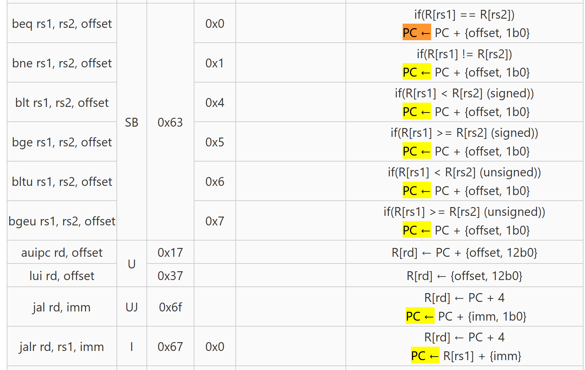

只有在一些特定的情况下为正常的

| type/inst     | opcode | opcode(binary) | funct3 | BrEq | BrLt |      |
| ------------- | ------ | -------------- | ------ | ---- | ---- | ---- |
| R-type        | 0x33   | 0110011        |        |      |      |      |
| I-type        | 0x13   | 0010011        |        |      |      |      |
| load          | 0x03   | 0000011        |        |      |      |      |
| jalr          | 0x67   | 1100111        |        |      |      | 1    |
| csr           | 0x73   | 1110011        |        |      |      |      |
| S-Type        | 0x23   | 0100011        |        |      |      |      |
| B-Type        | 0x63   | 1100011        | 000    | 1    |      | 1    |
|               |        |                | 001    | 0    |      | 1    |
|               |        |                | 100    |      | 1    | 1    |
|               |        |                | 101    |      | 0    | 1    |
|               |        |                | 110    |      | 1    | 1    |
|               |        |                | 111    |      | 0    | 1    |
| U-Type(auipc) | 0x17   | 0010111        |        |      |      |      |
| U-Type(lui)   | 0x37   | 0110111        |        |      |      |      |
| J-Format      | 0x6f   | 1101111        |        |      |      | 1    |

| type/inst     | opcode | opcode(binary) | funct3 | funct3(binary) | B-inst | BrEq | BrLt | PCSel |
| ------------- | ------ | -------------- | ------ | -------------- | ------ | ---- | ---- | ----- |
| B-Type        | 0x63   | 1100011        | 0x0    | 000            | beq    | 1    |      | 1     |
|               |        |                | 0x1    | 001            | bne    | 0    |      | 1     |
|               |        |                | 0x4    | 100            | blt    |      | 1    | 1     |
|               |        |                | 0x5    | 101            | bge    |      | 0    | 1     |
|               |        |                | 0x6    | 110            | bltu   |      | 1    | 1     |
|               |        |                | 0x7    | 111            | bgeu   |      | 0    | 1     |
| jalr          | 0x67   | 1100111        | 0x0    |                |        |      |      | 1     |
| J-Format(jal) | 0x6f   | 1101111        |        |                |        |      |      | 1     |

首先实现Branch的方式

| fn3  |      |      | BrEq | BrLt | PCSel |
| ---- | ---- | ---- | ---- | ---- | ----- |
| A4   | A3   | A2   | A1   | A0   |       |
| 0    | 0    | 0    | 1    |      | 1     |
| 0    | 0    | 1    | 0    |      | 1     |
| 1    | 0    | 0    |      | 1    | 1     |
| 1    | 0    | 1    |      | 0    | 1     |
| 1    | 1    | 0    |      | 1    | 1     |
| 1    | 1    | 1    |      | 0    | 1     |
